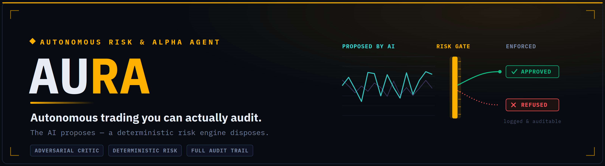

<p align="center">
  
</p>


### Autonomous Unified Risk & Alpha Agent

**Autonomous trading you can actually audit — the AI proposes, a deterministic risk engine disposes.**


---

## The problem

AI agents are increasingly given real-world power — moving money, executing trades, taking actions with no human in the loop. But **autonomy without accountability is dangerous.** Most autonomous systems are black boxes: they act, but they can't explain *why*, and nothing stops a confident-but-wrong model from causing real damage.

The question is no longer *"can the AI act?"* — it's **"can we trust *how* it acts?"**

## The solution

AURA is an autonomous trading agent built on a single principle:

> **The AI proposes. Deterministic code disposes.**

It pairs probabilistic AI reasoning with a hard, rule-based safety layer the AI **cannot override** — so every decision is **explainable, bounded, and fully auditable.** Trading is the demonstration domain because a bad autonomous decision costs money in seconds, but the same governance architecture applies to any high-stakes AI agent.

---

## How it works

For every opportunity, AURA runs a **four-stage decision pipeline**:

```
   ┌──────────────────────────────────────────────────────────┐
   │  REASONING LAYER  (probabilistic · LLM-powered)           │
   │                                                           │
   │   Market Agent  →  Strategy Agent  →  Critic Agent        │
   │   reads the      forms a trade      ATTACKS the trade,    │
   │   market         thesis             tries to break it     │
   └───────────────────────────┬──────────────────────────────┘
                               │  structured thesis + adversarial critique
                               ▼
   ┌──────────────────────────────────────────────────────────┐
   │  GOVERNANCE LAYER  (deterministic · NOT an LLM)           │
   │                                                           │
   │   Risk Engine  —  validates confidence, risk/reward,      │
   │   critic score, position size, portfolio exposure.        │
   │   Has the FINAL say. The AI cannot override it.           │
   └───────────────────────────┬──────────────────────────────┘
                               │  APPROVE / REJECT + reason
                               ▼
   ┌──────────────────────────────────────────────────────────┐
   │  EXECUTION + AUDIT LAYER                                   │
   │   Alpaca (paper) execution · SQLite memory ·              │
   │   full replayable decision trace                          │
   └──────────────────────────────────────────────────────────┘
```

### The agents

| Agent | Type | Responsibility |
|-------|------|----------------|
| **Market Agent** | LLM | Reads technical indicators (SMA, RSI, MACD, ATR) and judges trend, momentum, and volatility. |
| **Strategy Agent** | LLM | Turns the market read into a concrete trade thesis (BUY / SELL / HOLD) with stop distance and risk/reward. |
| **Critic Agent** | LLM | **Adversarial.** Its only job is to *attack* the thesis and expose every weakness — not to agree. |
| **Risk Engine** | Deterministic code | Independently enforces hard limits. **Intentionally not an LLM**, so the AI can never override its own safety rules. |

> **Why the Critic matters:** most multi-agent systems have agents that confirm each other. AURA's Critic is built to *disagree* — genuine adversarial reasoning that catches over-confident trades before they reach the risk engine.

---

## Key features

- **Adversarial self-critique** — the AI argues against its own trades before acting.
- **Deterministic risk governance** — hard limits (exposure, position size, risk/reward, confidence) enforced in code, not by the model.
- **Risk-aware position sizing** — every trade risks a fixed % of the portfolio, not a flat dollar amount.
- **Full decision trace** — every decision (taken *or refused*) is logged and replayable as an execution log.
- **Autonomous cycle** — one command scans a watchlist, runs the full chain per symbol, enforces risk, and executes.
- **Paper-only safety guard** — AURA refuses to run against a live-money account at the config level.

---

## Tech stack

- **Language:** Python 3.10+
- **LLM inference:** Groq (`openai/gpt-oss-20b`), structured JSON output
- **Market data & execution:** Alpaca (paper trading API)
- **Indicators:** pandas (SMA, EMA, RSI, MACD, ATR)
- **Persistence:** SQLite
- **Dashboard:** Streamlit + custom terminal UI (IBM Plex Mono/Sans)

---

## Getting started

### 1. Clone & install

```bash
git clone https://github.com/<your-username>/AURA.git
cd AURA
python -m venv venv
venv\Scripts\activate          # Windows
# source venv/bin/activate     # macOS / Linux
pip install -r requirements.txt
```

### 2. Configure keys

Copy the example env file and add your **paper-trading** keys:

```bash
cp .env.example .env
```

```env
ALPACA_API_KEY=your_paper_key
ALPACA_SECRET_KEY=your_paper_secret
ALPACA_PAPER=true
LLM_API_KEY=your_groq_key
```

- Alpaca paper keys: https://app.alpaca.markets (switch to **Paper Trading**)
- Groq API key: https://console.groq.com

> AURA will refuse to start if `ALPACA_PAPER` is not `true`.

### 3. Run an autonomous cycle

```bash
python run.py            # dry run — reasons & applies risk, no orders sent
python run.py execute    # sends approved trades to your Alpaca paper account
```

### 4. Launch the dashboard

```bash
python -m streamlit run dashboard/app.py
```

---

## Project structure

```
AURA/
├── run.py                     # entry point — runs one autonomous cycle
├── requirements.txt
├── .env.example
│
├── src/
│   ├── agents/                # LLM reasoning agents
│   │   ├── llm.py             #   shared Groq client (JSON mode + retry)
│   │   ├── market_agent.py    #   reads the market
│   │   ├── strategy_agent.py  #   forms the thesis
│   │   └── critic_agent.py    #   attacks the thesis (adversarial)
│   │
│   ├── risk/                  # deterministic governance (NOT LLM)
│   │   ├── limits.py          #   hard rule config
│   │   ├── position_sizing.py #   risk-based sizing
│   │   └── validator.py       #   the risk gate — final say
│   │
│   ├── alpaca/                # broker integration
│   │   ├── client.py          #   connection + account
│   │   ├── market_data.py     #   bars + indicators
│   │   ├── portfolio.py       #   exposure state
│   │   └── orders.py          #   execution
│   │
│   ├── core/
│   │   ├── orchestrator.py    #   the autonomous cycle
│   │   ├── memory.py          #   SQLite decision log
│   │   └── analytics.py       #   dashboard data
│   │
│   └── utils/
│       ├── config.py          #   env + paper-only safety guard
│       └── logger.py
│
├── dashboard/app.py           # Streamlit terminal UI
└── docs/architecture.md       # architecture deep-dive
```

---

## How AURA decides (example)

```
[001] MARKET     NVDA   bullish   · conf 80%
[002] STRATEGY   NVDA   BUY       · conf 75%
[003] CRITIC     NVDA   PROCEED   · score 62/100 · "momentum strong but extended"
[004] RISK       NVDA   APPROVED  · 46 sh · $9,977 · risk $1,000  (1% of portfolio)
```

And a refusal — the signature moment:

```
[001] MARKET     AMD    bearish   · conf 68%
[002] STRATEGY   AMD    SELL      · conf 65%
[003] CRITIC     AMD    PROCEED   · score 65/100
[004] RISK       AMD    REFUSED   · exposure would exceed limit
      → The AI wanted to trade. The deterministic risk engine said no.
```

---

## Roadmap

- Adaptive agent calibration — weight signals by historical performance
- Multi-strategy support (momentum, mean-reversion, breakout)
- Backtesting + baseline comparison (Buy & Hold vs AURA governance)
- A generalized **"trust layer" SDK** for autonomous agents beyond trading

---

## Disclaimer

AURA is a **research prototype for a hackathon.** It runs on **paper trading only** and is **not investment advice.** Do not connect it to a live-money account. Past or simulated performance does not indicate future results.

---

## License

MIT
